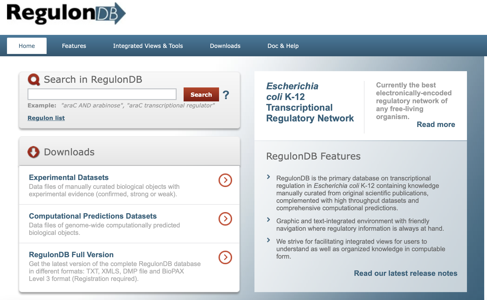
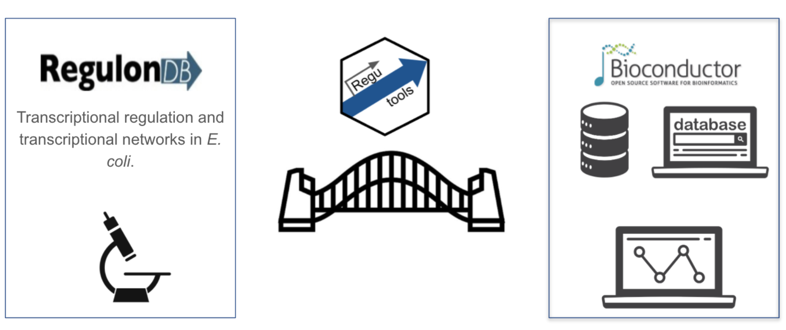
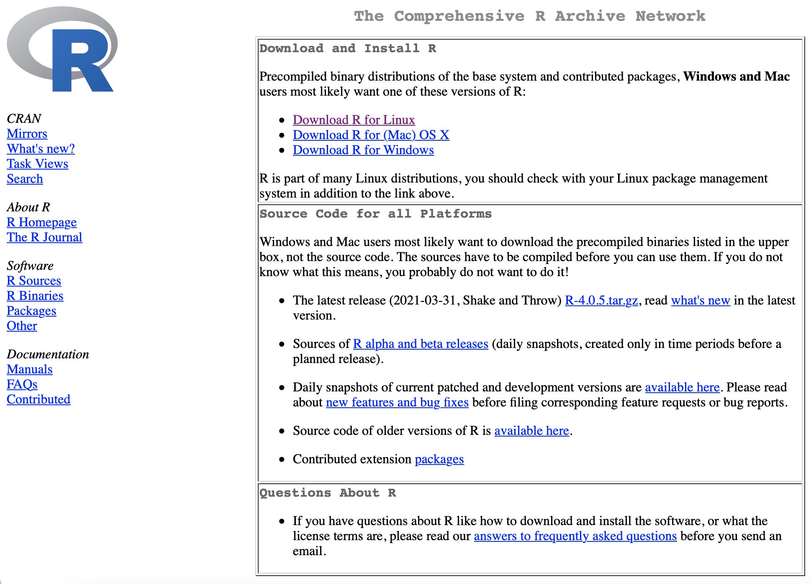
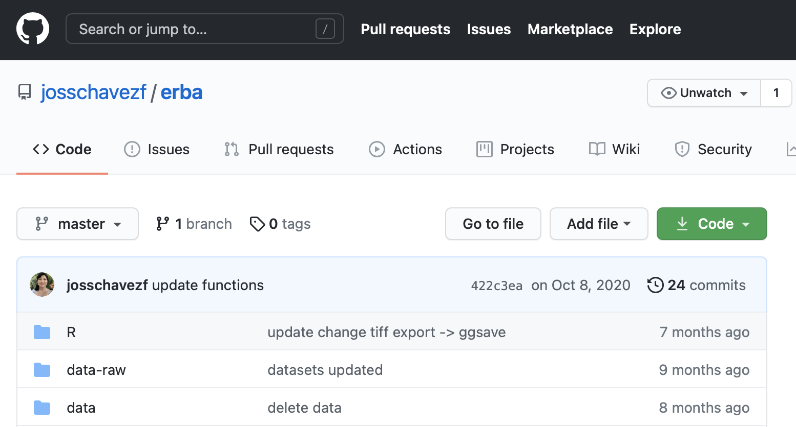
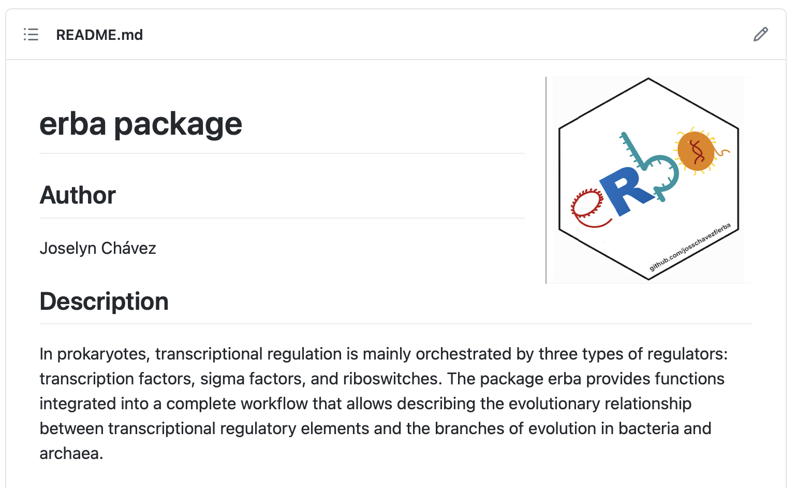
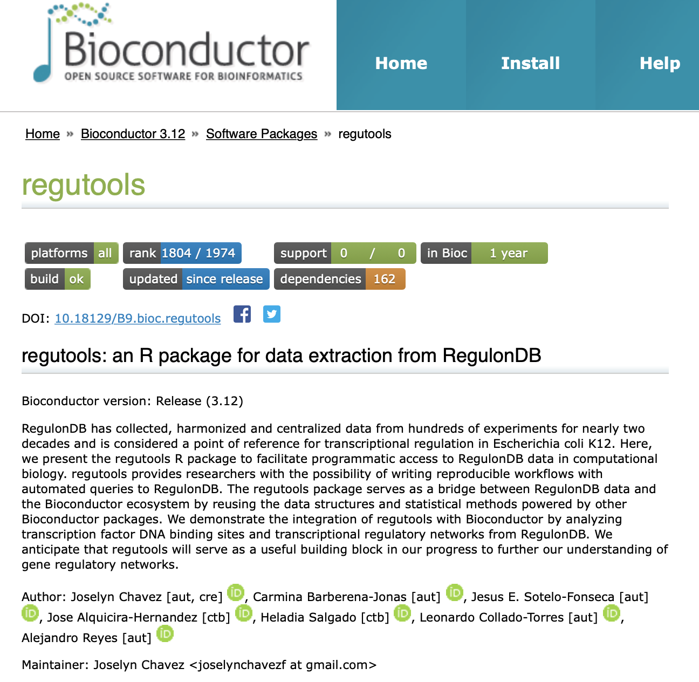
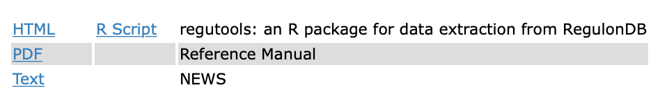
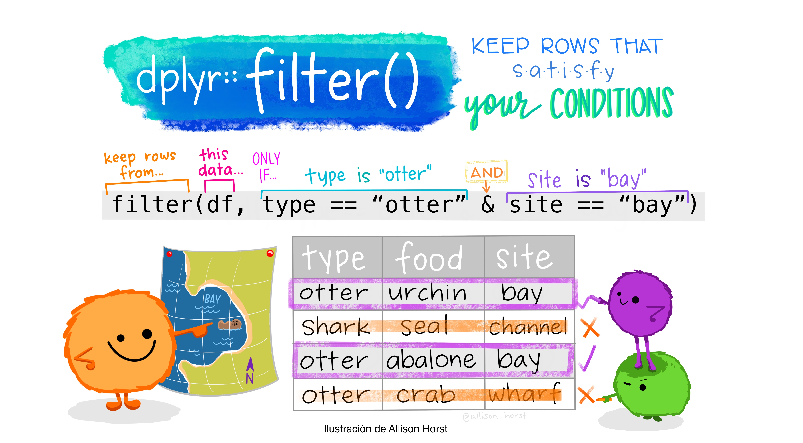
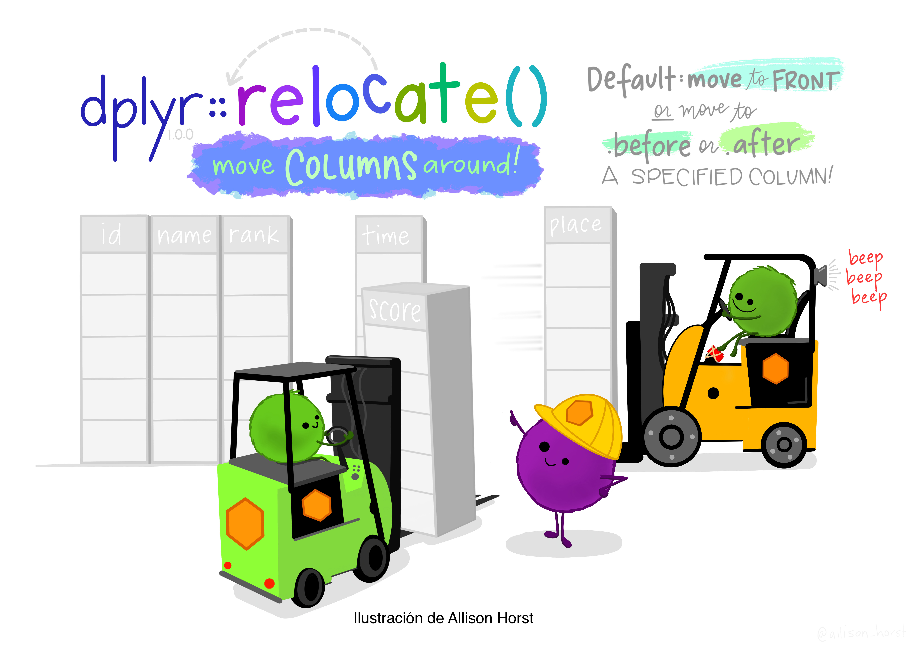

```{r, echo=FALSE}
library(knitr)
library(dplyr)
library(GenomicRanges)
options(width = 90)
```

```{r configuracion, include = FALSE}
xaringanExtra::use_clipboard()
```

# La base de datos regulonDB
<br>

- Contiene datos sobre la red de regulación transcripcional de *Escherichia coli* K12.
- Es una de las bases de datos mejor curadas.
- Incluye información experimental recopilada durante > 20 años.
- Se actualiza constantemente.

.center[
<http://regulondb.ccg.unam.mx>
]

[
```{r,out.width='65%',echo=FALSE,fig.align='center'}

```
](http://regulondb.ccg.unam.mx)

---
# Regutools permite el acceso a regulonDB de forma programática
<br><br>

```{r,echo=FALSE,out.width='100%',fig.align='center'}

```

---
class: chapter-slide

# Instalación

---
# Existen varias formas de instalar paquetes en R

.center[
## Desde CRAN ]

.pull-left[
.center[<https://cran.r-project.org>]<br>

```{r,echo=FALSE,out.width='100%'}

```
]

.pull-right[<br><br>
Usamos la función
```{r, eval=FALSE}
install.packages()
```

Por ejemplo:
```{r, eval=FALSE}
install.packages("ggplot2")
```
]
---
# Existen varias formas de instalar paquetes en R

.center[
## Desde Bioconductor ]

.pull-left[
.center[<https://bioconductor.org>]<br>

```{r,echo=FALSE,out.width='100%'}

```
]

.pull-right[
Necesitamos del paquete **BiocManager** que nos ayuda a conectar con Bioconductor.

```{r, eval=FALSE}
install.packages("BiocManager")
```

Usamos la función install.
```{r, eval=FALSE}
BiocManager::install()
```

Por ejemplo:
```{r, eval=FALSE}
BiocManager::install("BioStrings")
```
]

---
# Existen varias formas de instalar paquetes en R

.center[
## Desde GitHub ]

.pull-left[
.center[<https://github.com/josschavezf/erba>]<br>
```{r,echo=FALSE,out.width='80%',fig.align='center'}


```
]

.pull-right[
Necesitamos el paquete **devtools** para conectar con GitHub.

```{r,eval=FALSE}
install.packages("devtools")
```

Usando la función
```{r,eval=FALSE}
devtools::install_github()
```

Por ejemplo:
```{r,eval=FALSE}
install_github("josschavezf/erba")
```

]

---
# Instalando regutools
.pull-left[ <br><br>
.center[<https://bioconductor.org/> ]

```{r,echo=FALSE,out.width='100%'}

```
]

.pull-right[ <br>
** Código para instalación **
```{r,eval=FALSE}
install.packages("BiocManager")

BiocManager::install("regutools")
```
]

--
.pull-right[
<br>
** Documentación **

- Viñeta

```{r,eval=FALSE}
browseVignettes("regutools")
```

- Manual de referencia

```{r,echo=FALSE,out.width='100%'}

```
]

---
# Regutools descarga la base de datos de forma local

### Ventajas: 

- No dependes de la conexión a internet.
- Se descarga una sola vez por sesión.
- Si asignas un directorio de descarga, sólo necesitas descargarla una vez.

### Desventajas:
- Es necesario descargarla nuevamente cuando existen versiones actualizadas de regulonDB.

---
# Comencemos!

- Cargamos la paquetería:
```{r,message=FALSE}
library(regutools)
```

- Conectamos con la base de datos.
  
Si la base no se encuentra de forma local, se descarga en una ubicación temporal.

```{r,eval=FALSE}
regulondb_conn <- connect_database()
```

Si le indicamos una ruta de descarga, sólo necesitaremos descargar la base una vez.

```{r,echo=FALSE, warning=FALSE,message=FALSE}
library(BiocFileCache)
```

```{r,message=FALSE}
regulondb_conn <- connect_database(bfc = BiocFileCache("base"))
```

---
# El entorno de regutools requiere un objeto de tipo regulondb
<br>

.left-column[
- Este objeto conserva los metadatos a lo largo del análisis.
- A futuro habrán otros organismos disponibles.
- Cada función requerirá al objeto regulondb como primer argumento.

]

.right-column[
```{r}
e_coli_regulondb <-
    regulondb(
        database_conn = regulondb_conn,
        organism = "E.coli",
        database_version = "v10.8",
        genome_version = "1"
    )
```
]

--
<br><br>
.right-column[
```{r}
e_coli_regulondb
```
]

---
class: chapter-slide

# Exploración de los datos

---
# Exploremos los datos disponibles en la base de datos

```{r}
list_datasets(e_coli_regulondb)
```

--
# Cada set de datos tiene diferentes columnas o atributos

```{r}
list_attributes(e_coli_regulondb, "GENE")
```

---
```{r}
list_attributes(e_coli_regulondb, "DNA_OBJECTS")
```

```{r}
list_attributes(e_coli_regulondb, "PROMOTER")
```

```{r}
list_attributes(e_coli_regulondb, "TF")
```

---
# Podemos acceder a un set de datos completo
<br>
```{r, eval=FALSE}
get_dataset(e_coli_regulondb,"GENE")
get_dataset(e_coli_regulondb,"GENE") %>% View()
```

El resultado es de clase regulondb_result

```{r}
get_dataset(e_coli_regulondb,"GENE") %>% class()
```

Para extraer, seleccionar y filtrar los datos tenemos dos opciones:

- Convertir el resultado a data.frame o tibble.
- Usar los argumentos de filtrado de la función.

---
## Opción 1: Convertir el resultado a data.frame o tibble

```{r}
resultado <- get_dataset(e_coli_regulondb,"GENE") %>% as_tibble()

resultado[1:5,1:3]

colnames(resultado)
```

---
# A partir de aquí podemos usar cualquier función de tidyverse
<br>
```{r,echo=FALSE,fig.align='center',out.width='100%'}

```

---
class: middle, center
```{r,echo=FALSE,fig.align='center',out.width='80%'}
include_graphics("img/dplyr_mutate.png")
```

---
class: middle, center
```{r,echo=FALSE,fig.align='center',out.width='90%'}

```

---
```{r}
select(resultado,"id", "name", "strand","sigma_factor")
```

```{r,echo=FALSE,fig.align='right',out.width='50%'}

```

---
## Opción 2: Usar los argumentos de filtrado de la función

* Selección de columnas
```{r}
get_dataset(e_coli_regulondb, "GENE",
            attributes = c("id", "name", "strand", "sigma_factor"))
```

Usamos el argumento **attributes** para listar todos los nombres de columna o **atributos** que deseamos extraer.
---
* Selección (filtrado) de lineas

```{r}
get_dataset(e_coli_regulondb, "GENE",
            attributes = c("id", "name", "strand", "sigma_factor"),
            filters = list(strand = "forward"))
```

Usamos **filters** para seleccionar las lineas que cumplen una condición.
---
* Selección (filtrado) de lineas

```{r}
get_dataset(e_coli_regulondb, "GENE",
            attributes = c("id", "name", "strand", "sigma_factor"),
            filters = list(sigma_factor = "Sigma54"))
```

---
* Selección (filtrado) de lineas

```{r}
get_dataset(e_coli_regulondb, "GENE",
            attributes = c("id", "name", "strand", "sigma_factor"),
            filters = list(sigma_factor = "Sigma54",
                           strand = "forward"))
```

En **filters** usamos el formato de lista o **list** para enumerar todos los filtros que deseamos aplicar.

---
```{r}
get_dataset(e_coli_regulondb, "GENE",
            attributes = c("id", "name", "strand", "sigma_factor"),
            filters = list(name = "araC"))
```

--
Usamos **partialmatch** para buscar celdas que contienen un patrón de caracteres.

```{r}
get_dataset(e_coli_regulondb, "GENE",
            attributes = c("id", "name", "strand", "sigma_factor"),
            filters = list(name = "ara"),
            partialmatch = "name")
```
---

Debemos especificar en cuál filtro se encuentra el patrón a buscar.

```{r}
get_dataset(e_coli_regulondb, "GENE",
            attributes = c("id", "name", "strand", "sigma_factor"),
            filters = list(name = "ara",
                           strand = "forward"),
            partialmatch = "name")
```

<br>
Nota: Estos patrones NO consideran/permiten expresiones regulares.

---
class: chapter-slide
# Posición genómica de los elementos de regulación

---
# Genes dentro de un intervalo genómico

Podemos obtener los genes dentro de un **intervalo** de posiciones genómicas usando el argumento **interval**.

```{r}
get_dataset(e_coli_regulondb, "GENE",
            attributes = c("id", "name", "strand", "posright", "posleft"),
            filters = list(strand = "forward",
                           posright = c("10000", "30000")),
            interval = "posright")
```

---
# Obtención de todos los elementos de regulación dentro de un intervalo.

* Por defecto nos muestra sólo los genes presentes en el intervalo
```{r}
get_dna_objects(e_coli_regulondb,
                grange = GRanges("chr", IRanges(1, 5000)))
```
---
* Podemos elegir entre "-10 promoter box", "-35 promoter box", "gene", "promoter", "Regulatory Interaction", "sRNA interaction", or "terminator".

```{r}
get_dna_objects(e_coli_regulondb,
                grange = GRanges("chr", IRanges(200, 3000)),
                elements = c("gene", "promoter") )
```

---
# Podemos graficar los elementos de regulación con su posición genómica.

```{r,echo=FALSE}
e_coli_regulondb <-
    regulondb(
        database_conn = regulondb_conn,
        organism = "chr",
        database_version = "1",
        genome_version = "1"
    )
```

```{r,fig.align='center',out.width='50%'}
plot_dna_objects(e_coli_regulondb,
                 grange = GRanges("chr", IRanges(200, 3000)),
                 elements = c("gene", "promoter") )
```

---
class: chapter-slide
# Redes de regulación transcripcional

---
# ¿Cuáles son los reguladores de cierto gen?

### Por defecto el resultado se ve como una tabla.
```{r}
get_gene_regulators( e_coli_regulondb,
                     genes = c("araC"),
                     output.type = "TF" )
```
---
# ¿Cuáles son los reguladores de cierto gen?

### Podemos obtener los resultados en una sola línea.
```{r,eval=FALSE}
get_gene_regulators( e_coli_regulondb,
                     genes = c("araC"),
                     output.type = "TF",
                     format = "onerow" )
```

```{r,echo=FALSE}
get_gene_regulators( e_coli_regulondb,
                     genes = c("araC"),
                     output.type = "TF",
                     format = "onerow" ) %>% as_tibble()
```

---
# ¿Cuáles son los genes regulados por cada factor transcripcional?

### Puede ser una relación TF-GENE
```{r}
get_regulatory_network(e_coli_regulondb,
                       regulator = "AraC",
                       type = "TF-GENE")
```

---
### Relación TF-TF
```{r}
get_regulatory_network(e_coli_regulondb,
                       regulator = "AraC",
                       type = "TF-TF")
```
---
### Relación GENE-GENE

```{r}
get_regulatory_network(e_coli_regulondb,
                       regulator = "cpxR",
                       type = "GENE-GENE")
```

---
# Podemos visualizar estas redes de regulación con Cytoscape
<br>
.pull-left[<br><br>
```{r,eval=FALSE}
get_regulatory_network(
  e_coli_regulondb,
  regulator = "AraC",
  type = "TF-GENE",
  cytograph = TRUE)
```
]

.pull-right[
```{r,echo=FALSE,out.width='110%'}
include_graphics("img//network.png")
```
]
---
# Obtención de los sitios de unión de factores transcripcionales

```{r}
get_binding_sites(e_coli_regulondb, transcription_factor = "AraC")
```

---
class: chapter-slide

# Actualizaciones

---
# Consideraciones sobre las versiones de regulonDB y regutools
<br>
- Bioconductor y regutools se actualizan cada 6 meses. Obtén la última versión usando:
```{r, eval=FALSE}
# Para actualizar todos los paquetes de Bioconductor
BiocManager::install() 
# Para actualizar solamente regutools
BiocManager::install("regutools")
```
- Cada versión de regutools descarga la última versión disponible de regulonDB al momento de la actualización.
- Si surge una nueva versión en los meses intermedios, puede no verse reflejada inmediatamente.
- Puedes contactarnos en el sitio de BugReports <https://support.bioconductor.org/t/regutools/> o mediante los Issues de GitHub en <https://github.com/ComunidadBioInfo/regutools>


---
class: center
<br><br><br><br><br><br><br>
```{r,echo=FALSE,out.width="80%"}

```
<br><br><br><br><br><br>
.right[Ilustración de Allison Hill]
---
class: center, middle

# Diapositivas hechas con el paquete [xaringan](https://github.com/yihui/xaringan) de Yihui Xie y el theme [cand](https://github.com/josschavezf/seminario-regutools) de Joselyn Chávez

